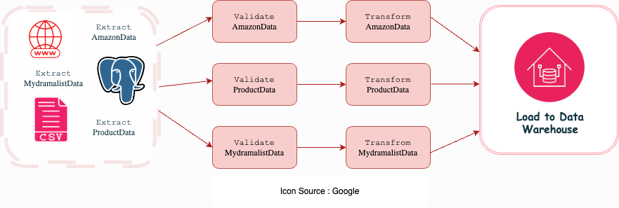

# ETL Pipeline Pacmann - Intro to Data Engineer

## Data Source

Data yang digunakan berasal dari tiga sumber:

1. **Sales data dari database PostgreSQL**: [Database ini dijalankan menggunakan Docker dengan data penjualan Amazon.](https://hub.docker.com/r/shandytp/amazon-sales-data-docker-db)
2. **Product data dalam bentuk file CSV**: [Data ini berisi informasi terkait informasi produk amazon dan tersedia sebagai file CSV.](https://drive.google.com/file/d/1J0Mv0TVPWv2L-So0g59GUiQJBhExPYl6/view?usp=sharing)
3. **Web scraping dari website MyDramalist**: [Data review drama Goblin yang diambil langsung dari website MyDramalist melalui teknik scraping.](https://mydramalist.com/18452-goblin)

**Disclaimer**

Proyek ini dibuat untuk tujuan pembelajaran tentang data engineering dan web scraping. Data yang diperoleh dari website hanya digunakan untuk analisis pribadi dan tidak untuk tujuan komersial.

## Problem 
Tim Sales memerlukan data penjualan dari PostgreSQL yang masih berantakan dan perlu diperbaiki formatnya. Tim Product membutuhkan data harga produk elektronik dari file CSV yang berantakan dan memiliki banyak missing values. Tim Data Scientist memerlukan data untuk riset Natural Language Processing (NLP) dan meminta bantuan web scraping karena belum memiliki data yang siap. 

## Solution
Untuk menyelesaikan masalah ini, kita akan membuat pipeline ETL yang akan mengumpulkan data dari berbagai sumber seperti database PostgreSQL, file CSV, dan web scraping, lalu memvalidasi dan membersihkan data sebelum akhirnya memuatnya ke dalam database PostgreSQL untuk keperluan analisis penjualan, marketing, dan proyek Natural Language Processing (NLP).

## Luigi ETL Output



### Penjelasan Pipeline

- **Data Extraction**:
  - **Sales Data**: Diambil dari database PostgreSQL.
  - **Product Data**: Data dari file CSV.
  - **Web Scraping**: Data diambil dengan melakukan scraping dari website.

- **Data Validation**:
  - Memeriksa kelengkapan data.
  - Memeriksa tipe data (misalnya, format tanggal, harga numerik, dll.).
  - Memeriksa missing value.

- **Data Transformation**:
  - Penggabungan data dari berbagai sumber (sales, product, dan scraping).
  - Transformasi kolom dengan mengisi missing value, mengubah tipe data, dll.

- **Load to Data Warehouse**:
  - Semua data yang telah dibersihkan dan ditransformasi dimuat ke dalam tabel di database PostgreSQL untuk analisis lebih lanjut.

## Stack & Tools

### Stack & Tools:
- **Python 3.x**
- **PostgreSQL (Database)**
- **Docker (Database dan lingkungan pengembangan)**
- **Luigi (Untuk orkestrasi pipeline ETL)**
- **Pandas (Manipulasi data)**
- **BeautifulSoup (Web scraping)**
- **Requests (Untuk request HTTP)**

### Libraries:
- `requests`
- `beautifulsoup4`
- `psycopg2`
- `pandas`
- `luigi`

## Langkah-Langkah Membuat Pipeline ETL

1. ### Membuat File `.env`
   **File `.env` digunakan untuk menyimpan variabel lingkungan yang diperlukan oleh aplikasi, seperti kredensial database, agar informasi sensitif tetap aman dan tidak terekspos di repository publik.**
   - Contoh isi file `.env`:
     ```plaintext
     DB_USERNAME="user"
     DB_PASSWORD="your_password"
     DB_HOST="localhost"
     DB_PORT="543"
     DB_NAME="your_database_name"
     ```
2. ### Inisialisasi dotenv
  ```bash
  pip install python-dotenv
  ```
  ```python
  from dotenv import load_dotenv

  load_dotenv()
  ```
3. ## Menjalankan Docker Compose
   **Menjalankan `docker-compose.yml` untuk menjalankan database PostgreSQL di container Docker.**

   **Untuk memulai container, jalankan perintah berikut di terminal:**
     ```bash
     docker-compose up -d
     ```
4. ## Membuat init.sql
   Buat file bernama init.sql yang berisi perintah SQL untuk menginisialisasi database, untuk pembuatan tabel ketika proses load.

5. ## Mmebuat file db_connector.py dan scraper_helper.py

   - File db_connector.py digunakan untuk mengelola koneksi ke database dan memudahkan akses ke database dalam pipeline ETL menggunakan library  `sqlalchemy` dan `psycopg2`
   - File scraper_helper.py digunakan untuk melakukan web scraping menggunakan library seperti `requests` dan `BeautifulSoup`

6. ## Membuat ETL Pipeline
   **Membuat script pipeline dengan nama file `etl_pipeline.py` yang berisi proses etl pipeline.**
   
7. ## Menginstall luigi
   ```bash
   pip install luigi
   ```
   ```python
   import luigi
   ```

9. ## Menjalankan Pipeline
   **Membuat script `run_etl.sh` yang berisi perintah untuk menjalankan pipeline.**

   **Setelah membuat script pipeline, pastikan script memiliki permission yang benar dengan menjalankan perintah:**
     ```bash
     chmod 755 run_etl.sh
     ```
   **Kemudian menjalankan:**
     ```bash
     ./run_etl.sh
     ```
10. ## Melakukan scheduling menggunakan`cron`

   **Membuka crontab**
   
     ```bash
     crontab -e
     ```
   **Kemudian melakukan scheduling pada jam 2 pagi**
   
     ```bash
     0 2 * * * /Users/user/data-eng/run_etl.sh >> /Users/user/data-eng/log/cron_log.log 2>&1
     ```
   **Verifikasi crontab untuk memastikan schedule telah dilakukan**
   
   ```bash
     crontab -l
   ```

   Until next time!


